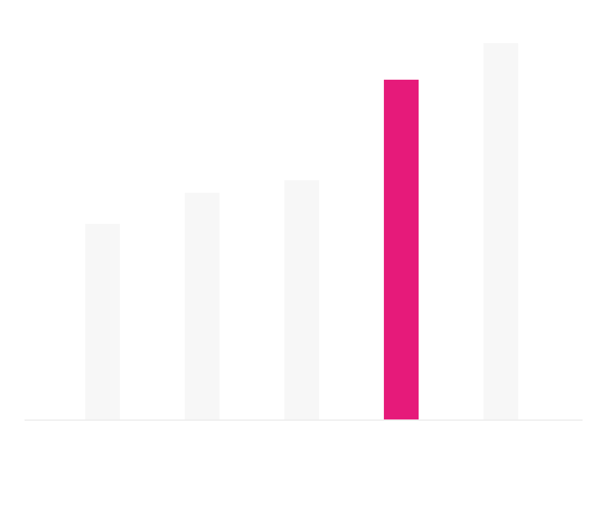
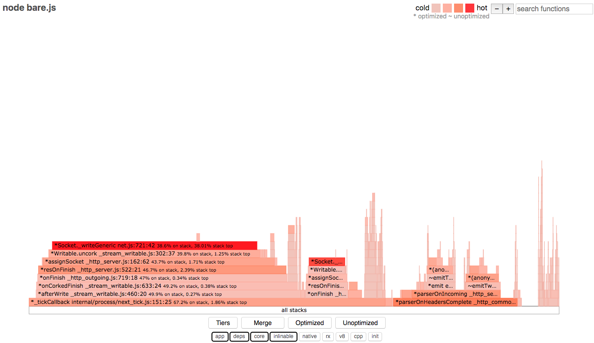
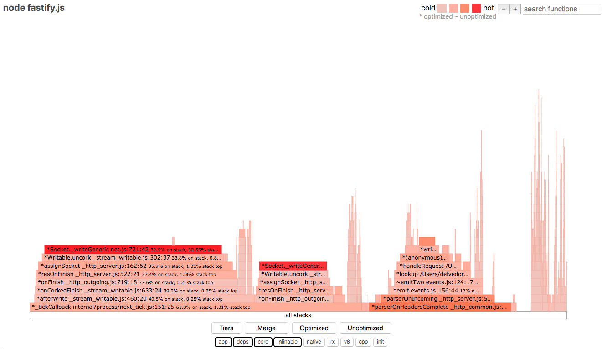
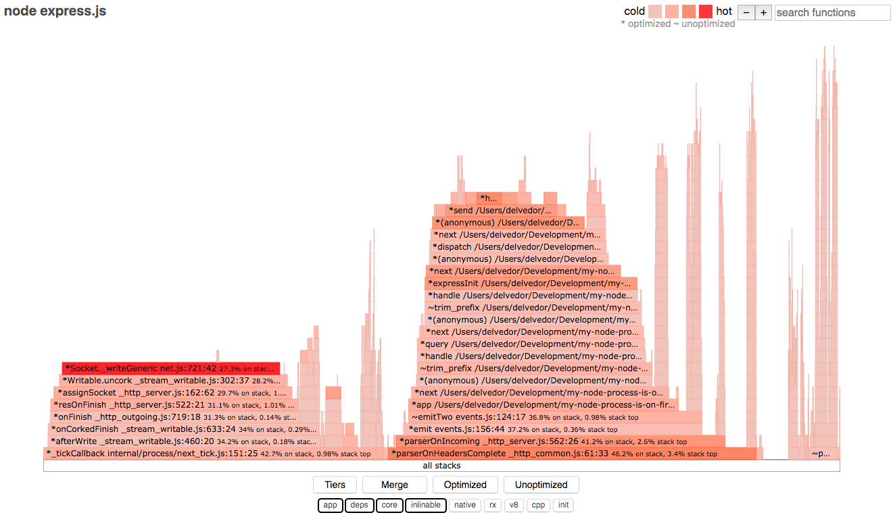
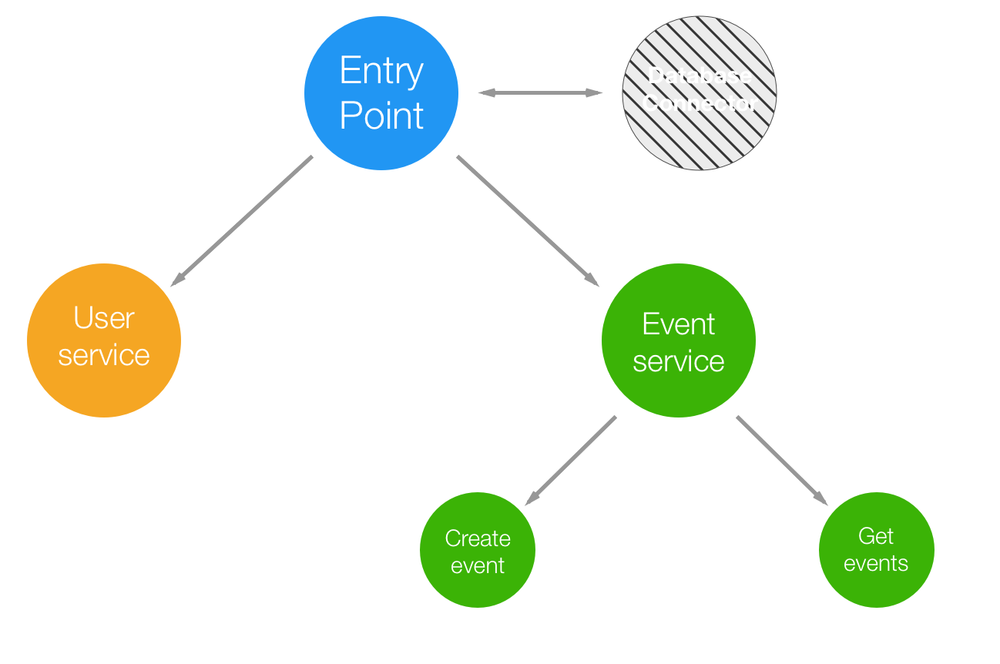
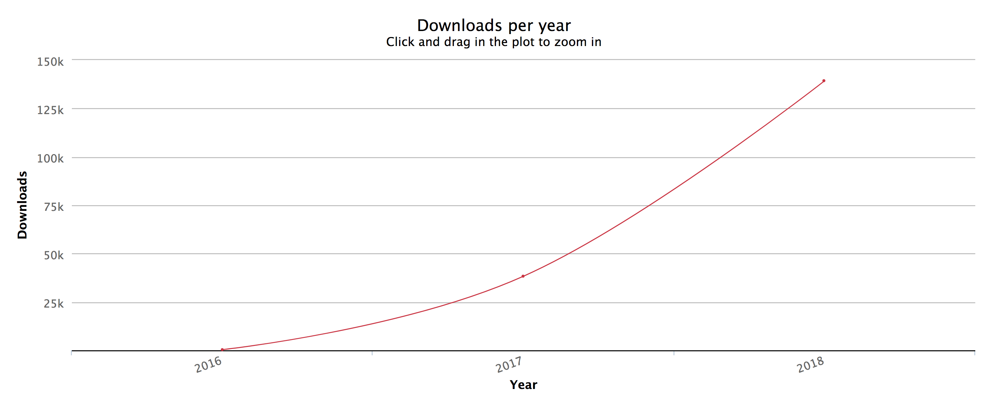

<!--
bodyclass intro-background
class align-right border-right
-->

# Why we built another framework

---

# Hey!

---

# I’ve built a *new framework!*

---

# Inside we are using *Express*.

---
<!--
class center center-image
-->


---

# Two years ago*.*

---
<!--
class nobreak
-->

*`fast`*`-json-stringify`

---
<!--
class row json-faster
-->

```js
const FJS = require('fast-json-stringify')

const stringify = FJS({
  type: 'object',
  properties: {
    firstName: { type: 'string' },
    lastName: { type: 'string' },
    age: { type: 'integer' }
  }
})

console.log(stringify({
  firstName: 'Tomas',
  lastName: 'Della Vedova',
  age: 25
}))
```

# 2-3x *faster*

---

# Express Hapi Restify Koa Micro Connect take-five total.js

---
<!--
class technical-debt boxed-em
-->

# Or you die as *innovator*,
# or you live long enough to become the *technical debt*.

---
<!--
class nobreak
-->

Can we avoid that*?*

---
<!--
bodyclass fastify-background
-->


---

# Design goals*.*

---

Design goals*.*
# Built for *speed*

---
<!--
class center-image small
-->



---

Design goals*.*
# Almost zero *overhead*

---
<!--
class small
-->

# Overhead:
# the *price* you are paying for a set of *features*.

---
<!--
class center center-image
-->



---
<!--
class center center-image
-->



---
<!--
class center center-image
-->



---

Design goals*.*
# As *light* as possible

---

Every feature we put in core is something that *we must maintain*.

<br/>

Change it in the future could lead to massive *breaking changes* for the community.

---
<!--
class small nobreak
-->

How can we avoid this*?*

---

Design goals*.*
# Extensible via *plugins*

---

```js
fastify.register(
  require('my-plugin'),
  { options }
)
```

---

```js
async function myPlugin (fastify, opts) {
  // register other plugins
  fastify.register(...)

  // add hooks
  fastify.addHook(...)

  // add decorator
  fastify.decorate(...)

  // add routes
  fastify.route(...)
}

module.exports = myPlugin
```

---
<!--
class center small-image
-->

# Plugins: *Architecture*


---
<!--
class center small-image
-->

# Plugins: *Encapsulation*


---

### Exposing functionality to *parents*
```js
const fp = require('fastify-plugin')

async function myPlugin (fastify, options) {
  fastify.decorate('util', yourAwesomeUtility)
  // now you can use it with `fastify.util`
}

module.exports = fp(myPlugin)
```

---
<!--
class center small-image
-->

# Plugins: *Encapsulation*


---

### *Encapsulation* enables many great things
### such as custom `log-level` per plugin

<br/>

```js
const fastify = require('fastify')()

fastify.register(require('./api/v1'), {
  prefix: '/v1',
  logLevel: 'info'
})

fastify.register(require('./api/v2'), {
  prefix: '/v2',
  logLevel: 'debug'
})

```

---
<!--
class center small-image
-->

# Plugins: Real world


---
<!--
class boxed-em
-->

# *Everything* is a plugin

---

Design goals*.*
# Developer *experience*

---
<!--
class nobreak
-->

API that is *easy to use* and understand;

<br/>

*Painless* transition from monolith to microservices;

<br/>

Extensive and quality *documentation*;

<br/>

*Responsive* to issues and questions.

---

Design goals*.*
# *Open* open source

---

Individuals making significant and valuable *contributions* are given commit-access to the project to contribute as they see fit*.*

<br/>

[openopensource.org](http://openopensource.org/)

---

# Two years after*.*

---

# Community impact*.*

---
<!--
class center-image
-->



---
<!--
class center-image
-->


---
<!--
class small
-->

# Currently, there are *74* officially recognized plugins

---
<!--
class small
-->

# *32* maintained by the core team

---
<!--
class boxed-em small
-->

# One plugin *every 10 days*

---
<!--
class small
-->

# *≥ 7700* stars

---
<!--
class small
-->

# *95* unique contributors

---
<!--
class small
-->

# *≥ 400* forks

---
<!--
class small
-->

# *≥ 80* releases

---
<!--
class small
-->

# *≥ 1600* commits

---
<!--
class small
-->

# Core team: *eight awesome people*

<br/>

[allevo](https://github.com/allevo) [delvedor](https://github.com/delvedor) [evanshortiss](https://github.com/evanshortiss) [lmammino](https://github.com/lmammino) [jsumners](https://github.com/jsumners) [mcollina](https://github.com/mcollina) [nwoltman](https://github.com/nwoltman) [starptech](https://github.com/starptech)

---

# Demo

---
<!--
bodyclass fastify-background
-->


---
<!--
class elastic-logo small
-->


---

# Thanks*!*
